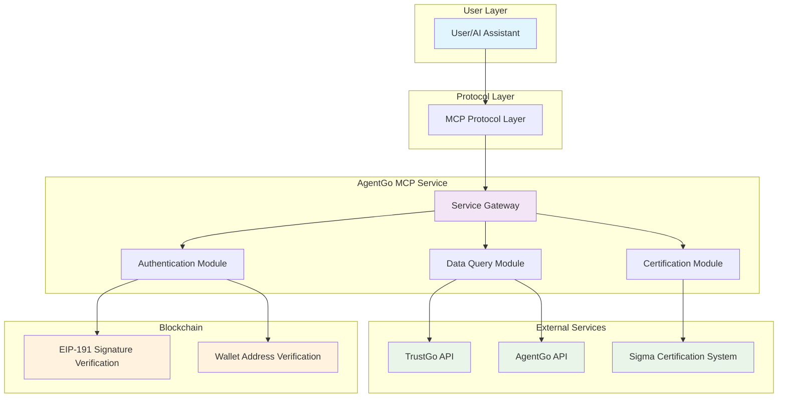

# AgentGo MCP Service Documentation

##  Table of Contents

1. [Overview](#overview)
2. [Architecture](#architecture)
3. [Integration with Cursor](#integration-with-cursor)
4. [Prompts and Tools](#available-prompts-and-tools)
5. [License](#license)

---

## Overview

**AgentGo MCP Service** is an authentication and data query service designed specifically for AI agents, providing blockchain identity authentication, agent scoring queries, market data analysis, and other core capabilities for AI assistants through the MCP protocol.

### Main Features

- **Secure Authentication** - Blockchain-based identity verification system
- **Data Queries** - Real-time agent scoring and market data retrieval
- **Certification Applications** - Sigma certification badge application and management
- **Visualization Analysis** - Multi-dimensional market data bubble chart display

###  Demo Video

This demo video shows how the AgentGo MCP Service is used in Cursor to support authentication, agent scoring, and market data visualization

[](https://www.youtube.com/watch?v=9j6Ghq6FOvA)

---

## Architecture




* **User Layer**: AI assistants or user interfaces
* **Protocol Layer**: MCP standard protocol processing
* **Service Layer**: AgentGo core business logic
* **External Services**: Third-party APIs and data sources

---

## Integration with Cursor
To connect to the MCP server from Cursor:

1. Open Cursor and go to Settings (gear icon in the top right)
2. Click on "MCP" in the left sidebar
3. Click "Add new global MCP server"
4. Enter the following details:

Default mode

```json
{
   "mcpServers": {
      "AgentGoMcp": {
      "command": "python3",
      "args": ["gentgo_mcp_service.py"],
      "env": {
         "AGENT_ADDRESS": "0x39a39981bF87EE0e8E9D6434A56f00758c9666f0"
      }
      }
   }
}
```

---

## Prompts and Tools

### Prompts

| Name | Description | Usage Example |
|------|-------------|---------------|
| `basic_login_flow` | Complete authentication process with wallet verification | "I want to authenticate with my wallet address 0x742d35..." |
| `query_agent_score` | Get detailed agent performance metrics and ratings | "What's the Sigma score for agent aixbt?" |
| `market_data_query` | Retrieve various market visualization data and trends | "Show me the current price bubble chart" |
| `certification_application` | Apply for official Sigma certification badges | "I want to apply for Sigma certification for aixbt" |

### Tools

| Name | Description |
|------|-------------|
| `trustgo_login` | Execute login verification with blockchain wallet |
| `query_sigma_score` | Query agent Sigma score and capability metrics |
| `query_price_bubble` | Get price bubble chart data for market visualization |
| `query_sigma_score_bubble` | Get score bubble chart data for agent analysis |
| `query_market_share_bubble` | Get market share bubble chart data with time options |
| `apply_sigma_certification` | Apply for Sigma certification (personal or proxy) |

---

## License

This project is licensed under the MIT License - see the [LICENSE](LICENSE) file for details.